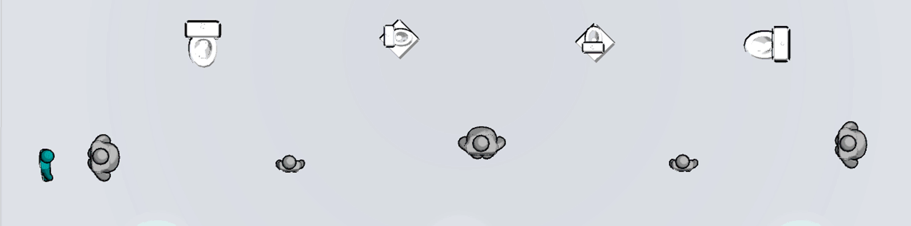

---

## About

Me and four others made Hatchoo! for Brains Eden 2017 with the theme `give and take`. 
<iframe title="vimeo-player" src="https://player.vimeo.com/video/224458091?h=0cbf5990da" width="640" height="360" frameborder="0" referrerpolicy="strict-origin-when-cross-origin" allow="autoplay; fullscreen; picture-in-picture; clipboard-write; encrypted-media; web-share"   allowfullscreen></iframe>

## Play
<iframe height="167" frameborder="0" src="https://itch.io/embed/156457" width="552"><a href="https://orcolom.itch.io/hatchoo">Hatchoo! by Orcolom</a></iframe>

## The team: DAEmons

- [Stijn Stroeckx](http://stroeckx.com)
  - Gameplay Programing
  - UI
- [Andrew Weeks](https://ajweeks.com)
  - UI
  - Sound
- [Jordy Hermie](https://jordyhermie.artstation.com/)
  - Art
- [Marieke Van Neutigem](http://mariekevanneutigem.nl/)
  - Gameplay programing
  - Levels
- [Joram Vandemoortele](https://orcolom.com)
  - Particle effect
  - Levels